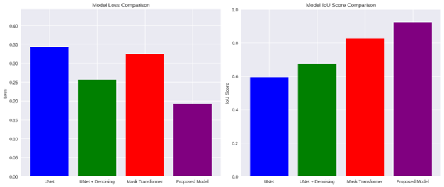
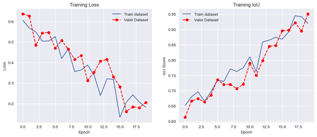

# Flood Area Segmentation Using Deep Learning

## 1. Project Overview

### 1.1 Aim:
The objective of this research is to create a strong and reliable framework based on deep learning that accurately identifies and separates flood areas using satellite images. The technology incorporates Total Variation Denoising to preprocess and boost picture quality by decreasing noise, hence enhancing the clarity of flood-affected areas. Afterwards, the Mask Former model, with the Swin Transformer network as its foundation, will be used to accurately partition flood zones. The goal is to get a high level of precision and dependability in flood mapping, which is essential for responding to and managing disasters, eventually leading to more efficient and prompt mitigation efforts.

### 1.2 Research Questions:
- How effective is Total Variation Denoising in enhancing satellite images for flood area segmentation compared to other denoising techniques?
- What are the advantages of using the Swin Transformer backbone in the MaskFormer model for flood segmentation over traditional convolutional neural network (CNN) backbones?

### 1.3 Objectives:
- Apply the Total Variation Denoising algorithm to mitigate noise and improve the quality of satellite pictures, resulting in enhanced visualization of flood-affected areas.
- Utilize the MaskFormer model, using the Swin Transformer backbone, to accurately partition flood zones in satellite images.
- Aggregate and preprocess a heterogeneous collection of satellite photos that include a range of flood scenarios for the purpose of training, validating, and testing the model.
- Utilize the provided dataset to train the integrated model and assess its performance by using measures such as Intersection over Union (IoU), accuracy, precision, and recall, guaranteeing a high level of segmentation accuracy.
- Comprehensively document the approach, findings, and potential enhancements while offering suggestions for future investigations and practical implementations in flood catastrophe management.

## 2. Dataset

For this research, the "Flood Area Segmentation" dataset was utilized, obtained from both the Earth Observation Data (EOD) platform from IEEE GRSS and Kaggle. The dataset is essential for training and evaluating the deep learning model specifically developed for accurately identifying and delineating flood-prone regions.

**Source:**
- [Kaggle - Flood Area Segmentation](https://www.kaggle.com/datasets/faizalkarim/flood-area-segmentation)
- [IEEE GRSS - Flood Area Segmentation](https://eod-grss-ieee.com/dataset-detail/dEF6SjNoODVqdUxyT1NwMjk0VEZKZz09)

## 3. Results

### Model Loss Comparison:

- The UNET model exhibits the largest loss, slightly above 0.35, suggesting challenges in effectively applying its learned knowledge to new test data. With Total Variation Denoising (TVD), the loss is reduced to approximately 0.25. 
- The Mask Transformer model, despite its advanced nature, shows a loss of approximately 0.3. The proposed model, integrating Mask Transformer with TVD, achieves the minimum loss of around 0.2.

### Intersection over Union (IoU) Comparison:
- The baseline UNET model achieves an IoU score of approximately 0.6. By implementing TVD, the IoU metric increases to 0.7.
- The Mask Transformer achieves an IoU of 0.85, and the proposed model achieves a nearly perfect IoU of 0.95, demonstrating superior accuracy.

### Learning Curve:

- The MaskFormer model achieves optimal performance when TVD is utilized, showing a significant decrease in training loss and an increase in IoU score, reaching 0.95 by epoch 20.

## 4. Libraries Used
```python

 cv2
numpy as np
matplotlib.pyplot as plt
pandas as pd
pathlib import Path
imghdr
seaborn as sns
skimage.restoration import denoise_tv_chambolle
sklearn.model_selection import train_test_split
tensorflow as tf
segmentation_models as sm
segmentation_models.metrics import iou_score
PIL import Image
torch
warnings
torch.utils.data import Dataset, DataLoader
torchvision.transforms as transforms
transformers import MaskFormerImageProcessor, MaskFormerForInstanceSegmentation

## 5. How to run code

1. Install the above libraries
2. Clone this repository 
3. use jupyter notebook to open project_code.ipynb
4. run the code.
